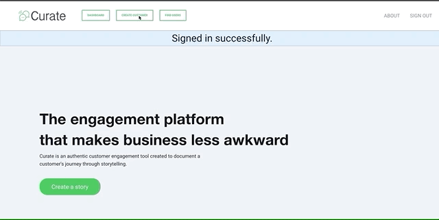

# Curate.io


Visit: https://curate-io.herokuapp.com/

Curate is a "pure" engagement tool created to strengthen a user's relationship with its clients through a customer's diary. Users can build a full-fledged profile for their customers (or import their profiles from HubSpot), and keep track of their interactions via diary logs.
Curate.io was built to **discourage ineffective first contacts such as template sales emails, scripted phone calls, and cold LinkedIn messages, and encourage more authentic relations!**

[](https://app.codeship.com/projects/355925)


# Getting started

After you fork, download, or clone the repo, please execute the following commands to get the application to run locally:

```
bundle install
yarn install
rake db:create
rake db:migrate
rake db:seed
```
Finally, run the following commands on separate tabs:

```
rails server
yarn start
```
To access the application locally from your browser, visit:
```
localhost:3000/mainpage
```
***

# Usage

After signing up/signing in, click on the "New Customer" button located on the navbar or the dashboard and create your first customer tile.




While on your customer's show page you can write, delete, and pin your favorite logs to their page. Additionally, you can edit and delete customers from their show page.


Other things you can do in Curate.io:

* Lookup other registered users and import their customers to your dashboard
* Edit a customer's profile
* Import contacts through the Hubspot API **(only available on the live website so far)**

***

**Built with:**
  - React
  - Ruby on Rails
  - Webpacker
  - Foundation 6
  - AWS S3
  - Carrier Wave gem (file uploading)
  - Devise gem (user authentification)
  - HTTParty gem (API requests)
  - PostgreSQL 15
  
**Tested with:**
  - Capybara
  - Enzyme/Jasmine (ran in Karma)
  - PhantomJS
  - RSpec
  - Shoulda-matcher/FactoryBot
 
 ***
 # Contributing
 In case you want to add anything to this repo, please follow the following steps to ensure a smooth PR process.
   1) Follow the [Rubocorp](https://github.com/rubocop-hq/ruby-style-guide) style guide for ruby and the [standardJS](https://standardjs.com/) guide for javascript.
   2) Run all tests before doing a PR request (```yarn test``` and ```rspec```)
   3) Update README if you have implemented any new features.
   4) Write meaningful commit messages!

***
# License

MIT License

Copyright (c) 2019 Pablo Mujica


